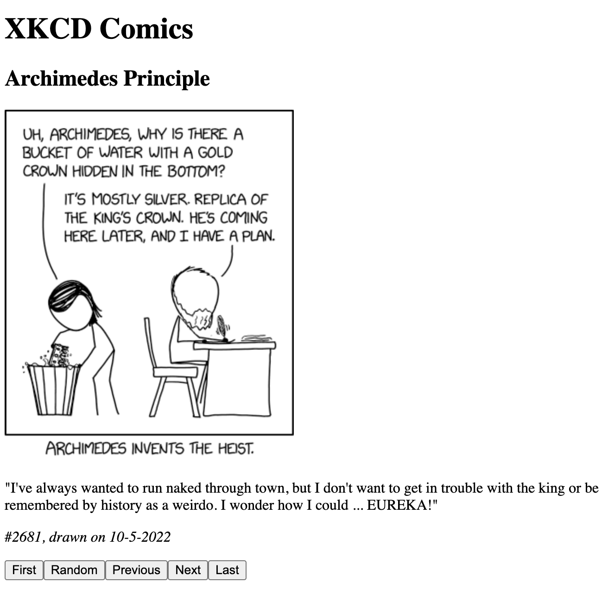

# Lab 3: Creating a React XKCD Browser

In this assignment, you will use React to build an application that uses
an API to browse XKCD comics.

## Tutorial

Use the [tutorial](/TUTORIAL.md)
to create the application. This will help you create most
of the functionality. Once you are done, your lab should look like this:

## Link to GitHub repository

In a footer, you must include a link to your GitHub repository, which must be
stored in GitHub Classroom.

## Submission

On Canvas, submit the URL for your website, which should be running on
your server.

